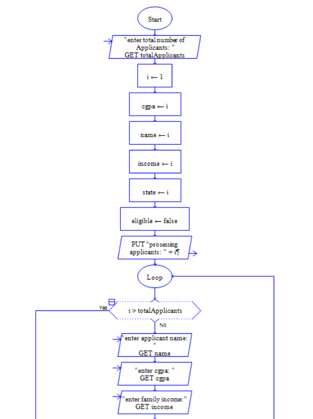
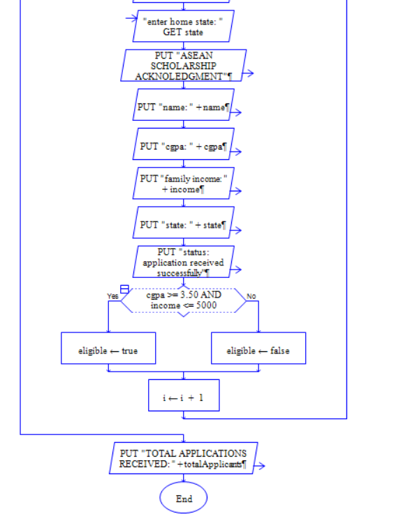

# ASEAN Scholarship selection Algorithm (Simulation)
This project is RAPTOR based algorithm that simulates ASEAN Scholarship selection.
## important notice
this is a **dummy project**.
use only:
- dummy names
- sample score
- hypothetical data
## files
ASEAN Scholarship Selection Algorithm.rap_GITHUB.rap
## disclaimer
this is NOT nan official scholarship systems.
it is for educational and demonstration purpose only.
## how to use
1. download the .rap file
2. open it using RAPTOR
3. enter sample values only
## flowchart preview

## flowchart preview (Version 2)
## Flowchart Preview (Version 2)

